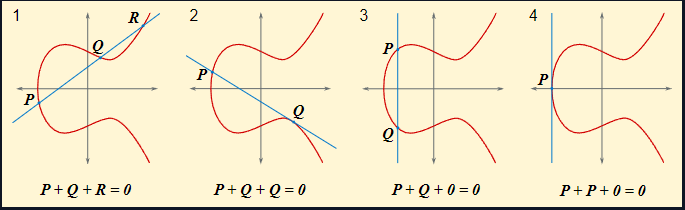
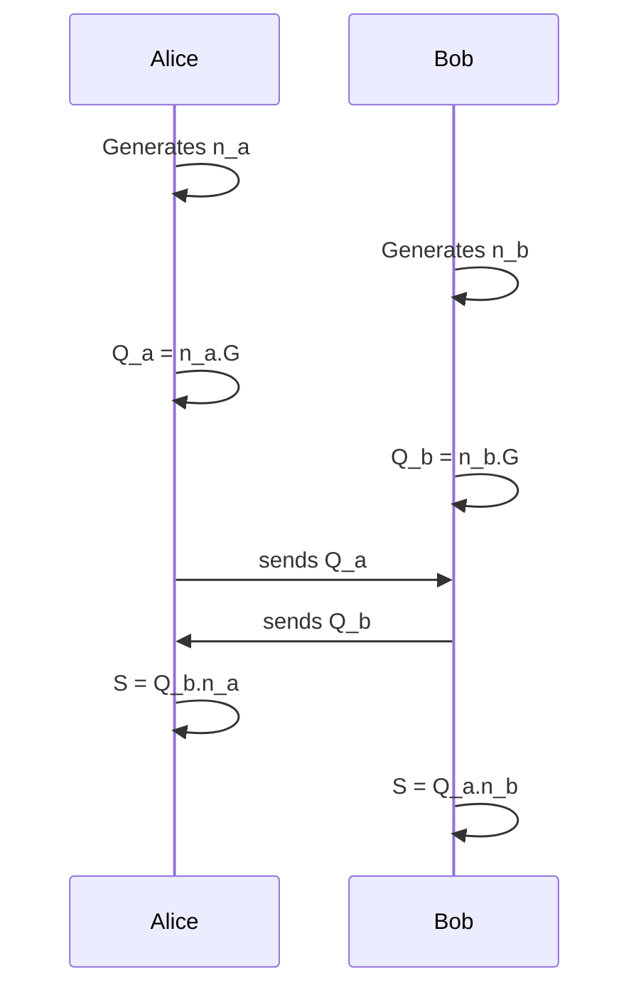

# Elliptic curves - Background

## Elliptic curve format
$Y^2 = X^3 + a X + b$

An elliptic curve E is the set of solutions to a Weierstrass equation:
$$E: Y^2 = X^3 + a X + b$$
together with a point at infinity $O$. The constants $a,b$ must satisfy the relationship:
$$4a^3 + 27 b^2 \neq 0$$
to ensure that the are no singularities on the curve.

ECC relies on the hardness of finding the $n$ such that $Q = nP$ given $Q$ and $P$.

## Operations
Point addition has the following properties:
- (a) $P + O = O + P = P$
- (b) $P + (−P) = O$
- (c) $(P + Q) + R = P + (Q + R)$
- (d) $P + Q = Q + P$

## Elliptic Curve Cryptography
We study elliptic curves over a finite field $\mathbb{F}_p$. The elliptic curve will no longer be a curve, but a collection of points whose $x,y$ coordinates are integers in $\mathbb{F}_p$.

# Starter
## Point Negation
### Summary of text
$E(\mathbb{F}_p) = \{(x,y) : x,y \in \mathbb{F}_p satisfying: y^2 = x^3 + a x + b\} \cup O$

For all the starter challenges, we will work with $E: Y^2 = X^3 + 497 X + 1768, p: 9739$

The solution is basic: $\forall P in \mathbb{F}_p$ such that $P={x,y}$, $-P={x,-y}$

## Point addition

The algorithm for the addition of two points $P+Q$:
- 1. If $P=O$, then $P+Q=Q$
- 2. Otherwise, if $Q=O$, then $P+Q=P$
- 3. Otherwise, say $P={x_1,y_1}$ and $Q={x_2,y_2}$
  - 1. If $x_1=x_2$, and $y_1=-y_2$, then $P+Q=O$
  - 2. Otherwise:
    - 1.1 if $P \neq Q: \lambda = (y_2 - y_1)/(x_2 - x_1)$
    - 1.2 if $P = Q: \lambda = (3x_1^2 + a) / 2y_1$
    - 2. $x_3 = \lambda^2 - x_1 - x_2$, and $y_3 = \lambda (x_1-x_3) - y_1$
    - 3. $P+Q = (x_3, y_3)$

Remark: As we work in a finite field, calculations are done $mod\ p$. We do not "divide" by an integer, we instead multiply by the modular inverse of a number. (e.g. $1/5 = 9\ mod\ 11$)

Working with $E: Y^2 = X^3 + 497 X + 1768,\ p: 9739$

## Scalar Multiplication
Scalar multiplication of two points is defined by repeated addition: $3P = P+P+P$

The algorithm for efficiently calculate scalar multiplication of a point on an elliptic curve:
- **Double and Add algorithm for the scalar multiplication of point $P$ by $n$**
- Input: $P \in E(\mathbb{F}_p)$ and an integer $n > 0$
- 1. Set $Q=P$ and $R=O$
- 2. Loop while $n > 0$:
  - 2.1. If $n \equiv 1 \ mod \ 2$, set $R = R+Q$
  - 2.2. Set $Q = 2Q$ and $n=[n/2]$
  - 2.3. If $n > 0$, continue with loop at step 2
- 3. Return the point $R$, which equals $nP$

*Note: This is not the most efficient algorithm, there are many interesting ways to improve this calculation up, but this will be sufficient for our work*

Working with $E: Y^2 = X^3 + 497 X + 1768,\ p: 9739$

## Curves and Logs
The Ellipitic Curve Discrete Logarithm Problem (ECDLP) is the problem of finding an integer $n$ such that $Q = nP$. Scalar multiplication of a point in $E(\mathbb{F}_p)$ seems to be a hard problem to undo. The most efficient algorithm runs at $p^{1/2}$ time.

That makes it a great candidate for a trapdoor function.

### Scenario
Alice and Bob want to create a shared secret so they can start encrypting their messages with some symmetric cryptographic protocol. They don't trust their connection, so they need a way to create a secret others can't replicate.

First, they agree on a curve $E$, a prime $p$ and a generator point $G$.

*Note: it is really important that the order of $G$ is prime. It is recommended to use a preconstructed curve where a client is given the curve, the prime and the generator to use. Constructing **secure curves** is complicated.*

### Protocol
- Alice generates a secret random integer $n_a$ and calculates $Q_a = n_a G$
- Bob generates a secret random integer $n_b$ and calculates $Q_b = n_b G$
- Alice sends $Q_a$ to Bob. Bob sends $Q_b$ to Alice. Attacker Eve is unable to calculate $n_a$ or $n_b$ in reasonable time.
- Alice then calculates $S = n_a Q_b$, Bob calculates $S = n_b Q_a$
- Due to scalar multiplication associativity: $S = n_a Q_b = n_b Q_a$
- Alice and Bob can use $S$ as their shared secret.

